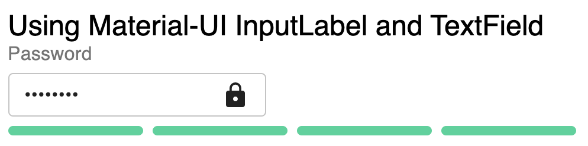
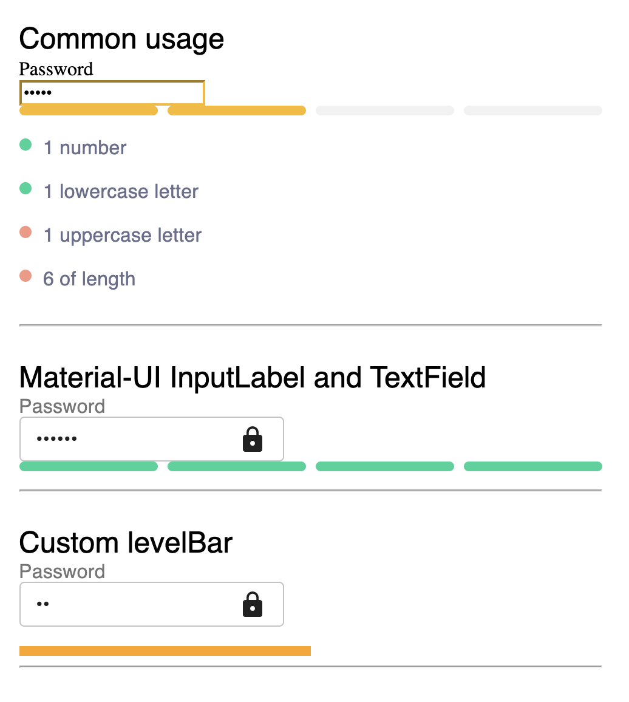

# React-Nice-Input-Password

[](https://travis-ci.org/renanborgez/react-nice-input-password)
[](https://coveralls.io/github/renanborgez/react-nice-input-password?branch=master)
[](https://app.fossa.io/projects/git%2Bgithub.com%2Frenanborgez%2Freact-nice-input-password?ref=badge_shield) [](https://snyk.io//test/github/renanborgez/react-nice-input-password?targetFile=package.json)

An input password built with and for [React](http://facebook.github.io/react/index.html)
and works nicely with [Material-UI](https://material-ui.com/)

## Demo

[https://codesandbox.io/s/o1v16rqqrz](https://codesandbox.io/s/o1v16rqqrz)

### Material UI Support
[](docs/material.png)

### And more ...
[](docs/andmore.png)

## Installation

```
npm install react-nice-input-password --save
```

## Usage

```js
import NiceInputPassword from 'react-nice-input-password';
import 'react-nice-input-password/dist/react-nice-input-password.css'; // Optional
```

React-Nice-Input-Password uses the traditional input[type=password] behinde the cenes.
The strenght configuration can be passed as an `array` of `objects` to the prop `securityLevels`.

You can see a sample of code bellow:

```js
import React from 'react';
import NiceInputPassword from 'react-nice-input-password';
import 'react-nice-input-password/dist/react-nice-input-passord.css';

class App extends React.Component {
  state = {}
  handleChange = (data) => {
    this.setState({
      [data.name]: data.value,
    });
  }
  render() {
    const { passwordField } = this.state;
    const value = passwordField && passwordField.value;

    return (
      <NiceInputPassword
        label="My password field"
        name="passwordField"
        value={value}
        securityLevels={[
          {
            descriptionLabel: '1 number',
            validator: /.*[0-9].*/,
          },
          {
            descriptionLabel: '1 lowercase letter',
            validator: /.*[a-z].*/,
          },
          {
            descriptionLabel: '1 uppercase letter',
            validator: /.*[A-Z].*/,
          },
        ]}
        showSecurityLevelBar
        showSecurityLevelDescription
        onChange={this.handleChange}
      />
    );
  }
}
```

### Usage with Material-UI

```js
import React from 'react';
import NiceInputPassword from 'react-nice-input-password';
import {TextField, InputLabel, Typography} from '@material-ui/core';
import LockIcon from '@material-ui/icons/Lock';

class App extends React.Component {
  state = {}
  handleChange = (data) => {
    this.setState({
      [data.name]: data.value,
    });
  }
  render() {
    const { passwordField } = this.state;
    const value = passwordField && passwordField.value;

    return (
      <NiceInputPassword
        label="My password field"
        name="passwordField"
        value={value}
        showSecurityLevelBar
        onChange={this.handleChange}
        LabelComponent={InputLabel}
        InputComponent={TextField}
        InputComponentProps={{
          variant: 'outlined',
          InputProps: {
            endAdornment: <LockIcon />,
          }
        }}
        securityLevels={[
          {
            descriptionLabel: <Typography>1 number</Typography>,
            validator: /.*[0-9].*/,
          },
          {
            descriptionLabel: <Typography>1 lowecase letter</Typography>,
            validator: /.*[a-z].*/,
          },
          {
            descriptionLabel: <Typography>1 uppercase letter</Typography>,
            validator: /.*[A-Z].*/,
          },
        ]}
      />
    );
  }
}
```

### Custom classNames

You can provide a custom `className` to the Nice Input Password and custom `className` to the color levels, which will be added to input, description and bullets level elements using `dangerClassName`, `warningClassName` and `successClassName`.

### Select Props

| Property | Type | Default | Description |
|:---|:---|:---|:---|
| label | string or function | undefined | The label showned on top of input element |
| name | string | undefined | The name used on input element `name={name}` |
| visible | boolean | false | Make the password visible by changing the input type to text |
| placeholder | string | (empty string) | The placeholder used on input element `placeholder={placeholder}` |
| className | string | (empty string) | Optional class to be passed to niceinputpassword context |
| style | object | undefined | Optional style to be passed to input field |
| LabelComponent | ReactComponent | input | Optional label component to be used
| InputComponent | ReactComponent | input | Optional input component to be used
| InputComponentProps | Object | null | Optional object to be passed to the custom `InputComponent`
| renderLevelBarComponent | Render function | null | Optional function to return a custom levelbar component
| normalClassName | string | 'none' | The className used on level color
| dangerClassName | string | 'danger' | The className used on level color
| warningClassName | string | 'warning' | The className used on level color
| successClassName | string | 'success' | The className used on level color
| startAdornment | ReactNode | undefined | Start adornment for this component
| endAdornment | ReactNode | undefined | End adornment for this component
| value | string | undefined | The value to be renderized on element
| showSecurityLevelBar | bool | false | Key to show or not the security level bullets of password
| showSecurityLevelDescription | bool | false | Key to show or not the security level description securityLevels object
| securityLevels | array of objects | [] | The array containing the objects to validate the password, see a sample of this object on after this table
| onChange | func | undefined | onChange handler: `@params: { name, value, isValid}`

## License

MIT Licensed. Copyright (c) Renan Borges.


[](https://app.fossa.io/projects/git%2Bgithub.com%2Frenanborgez%2Freact-nice-input-password?ref=badge_large)
